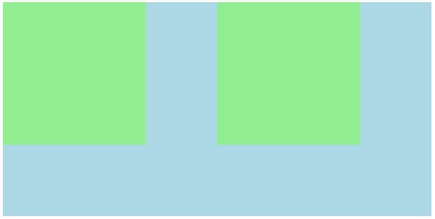
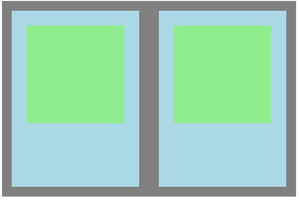
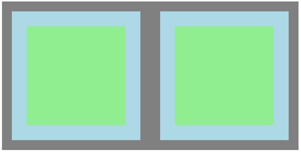

<!doctype html>
<html>
	<head>
		<title>HTML & CSS Exercises</title>

       ## 7.HTML & CSS - Styling fortsättning

        1. Skapa en ny katalog
        
        1. I denna skapar ni en index.html med basstruktur
        
        1. Skapa ett styles.css dokument som ni lägger i samma katalog som index.html
        
        1. Importera styles.css i index.html
        
        1. I ```body``` skapar ni en ```main``` med id "container". Denna skall ha följande stil: Bredd 600px, höjd 300px & display:flex. Display flex är något som kallas flexbox, detta kommer vi till närmre på senare i kursen.
        
        1. Inuti ```main``` skapar ni 2 divar, ge dem klassen "item". Dessa skall ha stilen: Bredd 300px, höjd 300px, bakgrundsfärg ljusblå.
        
        1. Inuti divarna lägger ni till en ```div``` till i varje, dessa skall ha klassen "inner-item" och stilen: Bredd 200px, höjd 200px, bakgrundsfärg ljusgrön.
        
        1. Nu skall de se ut som följande: <br>
        
        1. Lägg nu till så att "item" får en border grå border som är 20px bred och en padding som är 30px.
        
        1. Nu skall det se ut som följande, lägg märke till hur ```main``` har utvidgats.
        
        
        
        11. Lägg nu till ```box-sizing: border-box;``` för "item" och se hur det förändras. Med border box includeras allt i det elementen där det finns.
        
        12. Det skall sedan se ut som följande 
        
        13. Skapa nu en ```h3``` och sätt den till färgen röd genom att ange "red".
        
        14. Ange nu samma färg fast med ett hexadeciamlt värde och sedan genom att använda rgb. <a href="https://htmlcolorcodes.com" target="_blank">Här finns ett verktyg för att se färger i olika format</a>.
        
        15. Skapa nu en ```div``` som ni ger bredden 300px och höjden 400px samt en border som är ```1px solid black```. Använd id för att knyta an stylingen till denna i ert externa CSS dokument.
        
        16. Inuti denna skapar ni en paragraf. Innehållet i denna skall vara det första stycket som ni kopierar från <a href="https://sv.lipsum.com/" target="_blank">Lorem Ipsum</a>. Lorem Ipsum är utfyllnadstext som man kan använda om man vill ha text för att testa saker. Spara och se resultat i webbläsaren.
        
        17. Prova nu att sätta stylingen för diven ```overflow:``` till hidden, scroll och visible.
        
        18. Nu skall vi ändra lite på texten. Börja med att ändra font familjen till arial.
        
        19. Gör ni så att texten blir italic, storlek 3.2em och fet.
        
        20. Nu skall vi använda en font som finns på <a href="https://fonts.google.com/" target="_blank">Google fonts</a>. Välj ut en valfri, markera denna med ```+```. Klicka på rutan nere till höger för att öppna vald font. Använd något av sätten att importera fonten.
        
        22. Ange sedan CSS'en att ni skall ha den fonten för texten.
        
        ### Extrauppgifter - Skapa nedanstående med HTML & CSS
        
        
        
### W3schools övningar


* <a href="https://www.w3schools.com/css/exercise.asp?filename=exercise_dimension1" target="_blank">Dimensions ex. 1-2</a>
        * <a href="www.w3schools.com/css/exercise.asp?filename=exercise_boxmodel1" target="_blank">Box Model ex. 1-4</a>
        * <a href="https://www.w3schools.com/css/exercise.asp?filename=exercise_border1" target="_blank">Border ex. 1-4</a>
        * <a href="www.w3schools.com/css/exercise.asp?filename=exercise_margin1" target="_blank">Margin ex. 1-4</a>
        * <a href="https://www.w3schools.com/css/exercise.asp?filename=exercise_padding1" target="_blank">Padding ex. 1-3</a>
        * <a href="https://www.w3schools.com/css/exercise.asp?filename=exercise_css3_colors1" target="_blank">Colors ex. 1-4</a>
